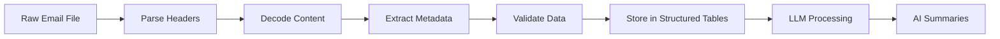

# Email Parsing: Why It's Essential Before LLM Processing

## 🤔 **The Question: Why Parse? Why Not Direct LLM?**

You're asking: *"Once ingested, can we not just process it using the LLM functions? What is the need to parse it?"*

**Short Answer**: Raw email files are messy, structured data that LLMs can't effectively process without parsing.

## 📊 **Raw Email Data vs. Parsed Data**

### **Raw Email File (What We Ingest):**
```json
{
  "payload": {
    "headers": [
      {"name": "From", "value": "John Smith <john.smith@company.com>"},
      {"name": "To", "value": "team@company.com, manager@company.com"},
      {"name": "Subject", "value": "Re: Q4 Budget - URGENT"},
      {"name": "Date", "value": "Wed, 15 Nov 2023 14:30:00 -0800"},
      {"name": "Content-Type", "value": "multipart/alternative"},
      {"name": "Message-ID", "value": "<abc123@company.com>"}
    ],
    "parts": [
      {
        "mimeType": "text/plain",
        "body": {"data": "SGkgVGVhbSwKCkkgaG9wZSB0aGlzIGVtYWlsIGZpbmRz..."}
      },
      {
        "mimeType": "text/html", 
        "body": {"data": "PGh0bWw+PGJvZHk+SGkgVGVhbSw8YnI+PGJyPkkgaG9w..."}
      }
    ],
    "attachments": [
      {"filename": "budget.xlsx", "data": "UEsDBBQAAAAI..."}
    ]
  },
  "internalDate": "1700083800000"
}
```

### **Problems with Raw Data for LLMs:**

1. **Base64 Encoded Content**: Email body is encoded
2. **Multiple MIME Parts**: HTML + Plain text versions
3. **Complex Headers**: Nested metadata structure
4. **Attachments**: Binary data mixed with text
5. **Inconsistent Formats**: Gmail API vs Outlook vs .eml files
6. **Metadata Noise**: Technical headers pollute content

## 🧹 **What Email Parsing Does**

### **Parsed/Clean Data (Ready for LLM):**
```sql
-- Clean, structured data in PROCESSED_EMAILS table
email_id: "abc123"
sender_email: "john.smith@company.com"  -- Extracted & cleaned
recipient_emails: ["team@company.com", "manager@company.com"]  -- Array format
subject: "Q4 Budget - URGENT"  -- Clean subject
email_body: "Hi Team, I hope this email finds you well..."  -- Decoded content
email_date: 2023-11-15 14:30:00  -- Proper timestamp
attachments: [{"name": "budget.xlsx", "size": 2048000}]  -- Metadata only
```

## 🔍 **Parsing Functions Breakdown**

### **1. Header Extraction**
```sql
-- Extract sender from complex header structure
(SELECT h.value::STRING 
 FROM TABLE(FLATTEN(EMAIL_CONTENT:payload.headers)) h
 WHERE h.value:name::STRING = 'From')
```

**Why needed**: Headers are nested JSON arrays, not simple strings.

### **2. Content Decoding**
```sql
-- Decode base64 email content
COALESCE(
    EMAIL_CONTENT:payload.parts[0].body.data::STRING,  -- Plain text
    EMAIL_CONTENT:payload.body.data::STRING            -- Simple format
)
```

**Why needed**: Email content is often base64 encoded for transport.

### **3. Format Normalization**
```sql
-- Handle different email formats
CASE 
    WHEN email_type = 'gmail_api' THEN [Gmail parsing logic]
    WHEN email_type = 'outlook' THEN [Outlook parsing logic] 
    WHEN email_type = 'simple' THEN [Simple format logic]
END
```

**Why needed**: Different email sources have completely different structures.

## ❌ **What Happens WITHOUT Parsing**

### **Direct LLM on Raw Data:**
```sql
-- This would be problematic
SELECT SNOWFLAKE.CORTEX.SUMMARIZE(
    raw_file_content::STRING  -- Messy, encoded, structured data
)
```

**Results in:**
- ❌ **Garbage summaries** from base64 encoded content
- ❌ **Token waste** on metadata noise
- ❌ **Missing key info** like sender/recipients
- ❌ **No searchability** by sender, date, subject
- ❌ **Poor analytics** without structured fields

### **Example Raw vs Parsed LLM Input:**

**Raw Input to LLM** (Bad):
```
{"payload":{"headers":[{"name":"From","value":"John Smith <john.smith@company.com>"}],"parts":[{"body":{"data":"SGkgVGVhbSwKCkkgaG9wZSB0aGlzIGVtYWls..."}}]}}
```

**Parsed Input to LLM** (Good):
```
Hi Team,

I hope this email finds you well. I'm writing to schedule our Q4 budget planning meeting.

Key agenda items:
- Review Q3 spending analysis
- Discuss Q4 budget allocations
...
```

## 🚀 **Benefits of Parsing Before LLM**

### **1. Better AI Results**
- ✅ Clean text = better summaries
- ✅ Proper context for LLM
- ✅ Reduced token usage
- ✅ More accurate sentiment analysis

### **2. Structured Analytics**
```sql
-- Possible AFTER parsing
SELECT 
    sender_email,
    COUNT(*) as email_count,
    AVG(sentiment_score) as avg_sentiment
FROM PROCESSED_EMAILS pe
JOIN EMAIL_SUMMARIES es ON pe.email_id = es.email_id
WHERE email_date >= '2023-11-01'
GROUP BY sender_email;
```

### **3. Advanced Search**
```sql
-- Search by metadata + content
SELECT * FROM PROCESSED_EMAILS 
WHERE sender_email = 'john@company.com'
AND email_date >= '2023-11-01'
AND email_body ILIKE '%budget%';
```

### **4. Data Quality**
- ✅ Email validation
- ✅ Duplicate detection  
- ✅ Format consistency
- ✅ Error handling

## 🔄 **The Complete Flow**



## 💡 **Alternative: Why Not Skip Parsing?**

You COULD do direct LLM processing, but you'd lose:

❌ **Metadata**: No sender, date, recipient info  
❌ **Search**: Can't filter by person/date  
❌ **Analytics**: No aggregation capabilities  
❌ **Quality**: Garbage in = garbage out  
❌ **Performance**: Inefficient token usage  
❌ **Scale**: Can't handle different email formats  

## 🎯 **Summary**

**Email Parsing is Essential Because:**

1. **Raw emails are messy, encoded, structured data**
2. **LLMs work best on clean, plain text**
3. **We need metadata for search, analytics, and filtering**
4. **Different email formats require normalization**
5. **Parsing enables better AI results with fewer tokens**

The stored procedures aren't just "extra steps" - they're **data transformation pipelines** that turn chaotic email files into clean, analyzable data that LLMs can effectively process.

**Think of it as**: Raw Email → Data Engineering → Clean Data → AI Processing → Insights
